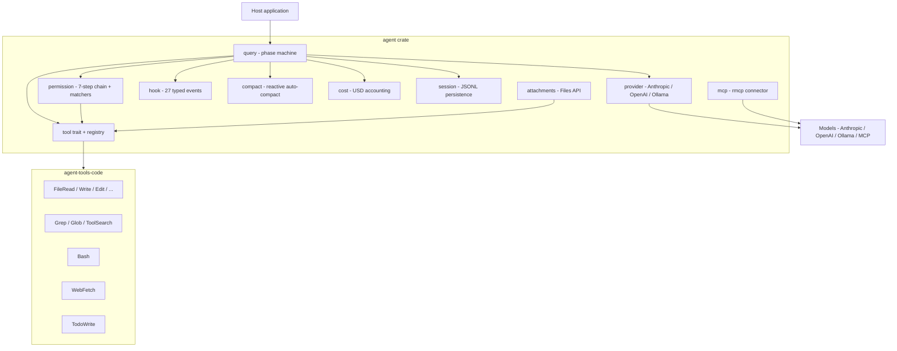

<div align="center">

# `agent-rs`

### A pure-Rust async runtime for shipping LLM agents.

Multi-provider · tool-capable end-to-end · structured permissions · real MCP · zero `unsafe`.

[](https://github.com/ZSeven-W/agent-rs/actions)
[](#testing)
[](https://www.rust-lang.org)
[](https://github.com/ZSeven-W/agent-rs/blob/main/crates/agent/src/lib.rs)
[](./LICENSE)

```text
┌─ user ──┐    ┌─── QueryLoop ───────────────────────────────────────┐
│ prompt  │───▶│ Streaming → ToolDispatch → ToolCollecting → Yield │──▶ Event::*
└─────────┘    │       ↑                                       │     │
               │       └──── auto-compact / hooks / cost ◀─────┘     │
               └─────────────────────────────────────────────────────┘
                  │            │            │            │
                  ▼            ▼            ▼            ▼
              Anthropic    OpenAI-*       Ollama         MCP servers
              (SSE)        (compat)       (local)        (stdio / HTTP)
```

</div>

---

## TL;DR

```rust
use agent::prelude::*;
use std::sync::Arc;

let provider = Arc::new(AnthropicProvider::new(std::env::var("ANTHROPIC_API_KEY")?));
let engine = QueryEngine::new(provider, "claude-opus-4-7").with_system("Be concise.");

let mut stream = engine.run("Summarize Rust's borrow checker in two lines.", AbortController::new()).await?;
while let Some(event) = futures::StreamExt::next(&mut stream).await {
    if let Event::TextDelta { delta } = event? { print!("{delta}") }
}
```

That's a complete agent — provider streaming, tool dispatch, hooks, permissions, auto-compaction, USD cost tracking — all wired up. Drop in Files API attachments, MCP servers, or the bundled coding tool pack with one extra line each.

---

## Why agent-rs?

- **🦀 Rust-native, library-only.** No `tokio::main` hijack, no global state, no `panic!` on bad input. `#![forbid(unsafe_code)]` in every crate. Drop it into a CLI, an IDE plugin, a desktop app, or a server — the runtime doesn't care.
- **🔌 Three providers, one event vocabulary.** Anthropic Messages (hand-rolled SSE — full prompt-cache + extended-thinking betas, **no SDK dep**), `async-openai` 0.36 (DeepSeek / Moonshot / Groq / OpenRouter / LM Studio), and local Ollama. Stream `Event::TextDelta`, `ToolUse`, `Usage`, `Result` — same shape from every backend.
- **🛠 Tool-capable end-to-end.** Define a tool, register it, the runtime wires the JSON Schema into the request body, dispatches `ToolUse` events to your code, feeds results back. Multi-turn loop with a phase machine. Receipt-order concurrent execution. **Permissions and cost tracking are wired through**, not bolted on.
- **🛡 Structured permissions that fail safe.** A 7-step decision chain (deny / ask / callback / bypass / allow / default-ask / dont_ask), composable `PermissionMatcher` rules over tool input shapes (JSON-pointer fields, glob/prefix/regex patterns, AnyOf / AllOf / Not), and a 4-level `SafetyClass` lattice where `Unknown ≡ Destructive` for gating — so unclassified tools never slip through.
- **🔗 MCP that actually plugs in.** Full Model Context Protocol client lifecycle: stdio child processes, streamable HTTP, OAuth 2.0 + PKCE, server-initiated elicitation, channel permissions, stale-handle reconnect repair. Tool calls don't serialize on a mutex. `close()` doesn't deadlock during slow RPCs.
- **💸 Cost accounting in nanodollar precision.** `Event::Usage` flows into a `CostTracker` with a model-price catalog (Anthropic + GPT defaults, BYO entries trivially). `u128` integer accumulator — no f64 drift across long sessions.
- **📎 Files API for big attachments.** `FilesClient` trait + `AnthropicFilesClient`. Smart helpers auto-route between inline base64 and uploaded `file_id` references based on size. Beta header gets added automatically when any block (including those nested in tool results) carries a `file_id`.
- **♻️ Reactive auto-compaction.** Token estimator + LLM-driven `<analysis>` / `<summary>` summarization, microcompact, session memory, post-cleanup file restoration. Long sessions stay inside the context window without losing critical state.
- **📦 Optional batteries.** Companion `agent-tools-code` crate ships generic FileRead/Write/Edit, Grep/Glob (gitignore-aware via `ignore`), Bash, WebFetch, TodoWrite, NotebookEdit (Jupyter .ipynb cells), and `ToolSearch` for deferred-tool discovery. Every tool declares its `SafetyClass`; a `WorkspacePolicy` enforces path containment + size caps + symlink rules. Pull only the features you want.

---

## Architecture



Streaming Events are the universal language: every provider emits the same `Event` taxonomy, so swap providers without touching tool code.

---

## Install

Two crates, both versioned together. Pull only what you need.

```toml
[dependencies]
# Runtime — always
agent = { git = "https://github.com/ZSeven-W/agent-rs", default-features = false, features = ["anthropic", "session-jsonl"] }

# Optional: ready-made coding tool pack (FileRead/Write/Edit, Grep/Glob, Bash, WebFetch, TodoWrite, ToolSearch)
agent-tools-code = { git = "https://github.com/ZSeven-W/agent-rs", default-features = false, features = ["fs", "search"] }
```

### `agent` features

| Flag | Pulls in | Notes |
|---|---|---|
| **`anthropic`** *(default)* | `reqwest` + `eventsource-stream` | Hand-rolled Anthropic SSE — no SDK dep. |
| `openai` | `async-openai` 0.36 | OpenAI-compatible providers. |
| `ollama` | `ollama-rs` 0.3 | Local models. |
| `mcp` | `rmcp` 1.5 | MCP client + production stdio/HTTP connector + OAuth/PKCE. |
| `session-jsonl` | `fs4` | JSONL persistence with file lock. |
| `swarm` | `fs4` + `notify` | Sub-agents, mailbox, teams. |
| `full` | all of the above | |

### `agent-tools-code` features

| Flag | Pulls in | Tools |
|---|---|---|
| **`fs`** *(default)* | (none) | FileRead / Write / Edit / ListDir / Mkdir / Move / Remove |
| **`search`** *(default)* | `regex` + `ignore` | Grep · Glob *(gitignore-aware)* |
| `shell` | `shell-words` | Bash *(timeout, abort, output cap)* |
| `web` | `reqwest` + `futures` | WebFetch *(HTML→text, size cap)* |
| `todo` | (none) | TodoWrite *(in-memory shared state)* |
| `notebook` | (none) | NotebookEdit *(Jupyter .ipynb cell-level edits)* |
| `all` | all of the above | |

`ToolSearch` is always-on (no feature flag) and lets you expose 50+ MCP tools without flooding the model's tool list — it picks them up via `select:Name1,Name2` or keyword search.

---

## Quickstart with bundled tools

```rust
use agent::prelude::*;
use agent_tools_code::{register_default, WorkspacePolicy};
use std::sync::Arc;

let policy = WorkspacePolicy::new(std::env::current_dir()?)?.into_arc();
let mut tools = ToolRegistry::new();
register_default(&mut tools, policy);   // FileRead, Write, Edit, ListDir,
                                        // Mkdir, Move, Remove, Grep, Glob

let provider = Arc::new(AnthropicProvider::new(std::env::var("ANTHROPIC_API_KEY")?));
let qloop = QueryLoop::builder(provider, "claude-opus-4-7")
    .tools(Arc::new(tools))
    .build();

let mut stream = qloop.run("List the .rs files in src/, then summarize main.rs.", AbortController::new()).await?;
while let Some(event) = futures::StreamExt::next(&mut stream).await {
    match event? {
        Event::TextDelta { delta } => print!("{delta}"),
        Event::ToolUse { name, .. } => eprintln!("\n→ calling {name}"),
        _ => {}
    }
}
```

That's the full picture: registry → provider → loop. The runtime handles tool dispatch, permission gating, hooks, cost tracking, and auto-compaction without you wiring anything else.

---

## Module surface

<details>
<summary><b><code>agent</code> crate</b> — runtime (15+ modules)</summary>

### Foundation

| Module | Purpose |
|---|---|
| `provider/` | Multi-provider LLM client. Tool definitions wired into request bodies; capability flags + streaming `Event` vocabulary. |
| `query/` | `QueryLoop` multi-turn phase machine. Reactive auto-compaction wired in. |
| `tool/` | `Tool` trait, `ToolRegistry`, `SafetyClass` lattice. Receipt-order concurrent execution via `ToolExecutor`. |
| `permission/` | 7-step chain + structured `PermissionMatcher` (Always / Field / ExactJson / AnyOf / AllOf / Not) + `StringPattern`. External-queue async approval. |
| `hook/` | 27 typed `HookEvent` variants. |
| `message/` | DAG-aware `MessageStore`. `ContentBlock::Document` for PDFs; `ImageSource::File` for Files-API references. |
| `stream/` | `Event` taxonomy: TextDelta / Thinking / ToolUse / ToolResult / Result / Usage / Error / Notice. |
| `session/` | JSONL persistence (schema v1) with atomic-rename + file lock. |
| `swarm/` | Sub-agents / teams. File-locked mailbox, in-process / tmux / iTerm2 backends. |
| `compact/` | Reactive auto-compaction. LLM-driven summarization, partial directions, microcompact, session memory. |
| `context/` | Sliding-window trim. |

### Service layer

| Module | Purpose |
|---|---|
| `api/` | Retry with decorrelated jitter, error classification, prompt-cache-break detection, secret redaction. |
| `cost/` | Model-price-aware USD accounting. `u128` nanodollars — no f64 drift. |
| `attachments/` | `FilesClient` + `AnthropicFilesClient`, smart size-aware routing. |
| `tokenizer/` | Pluggable trait. Real tiktoken plugs in via the trait. |

### Discovery + extensibility

| Module | Purpose |
|---|---|
| `mcp/` *(feature `mcp`)* | Full MCP client + production `RmcpConnector`. |
| `memdir/` | `MEMORY.md` directory loader with frontmatter + relevance scoring. |
| `skills/` · `plugins/` · `state/` · `bootstrap/` · `context_analysis/` · `tasks/` · `memory_extract/` · `remote/` | See [`crates/agent/src/`](./crates/agent/src/). |

</details>

<details>
<summary><b><code>agent-tools-code</code> crate</b> — optional coding tool pack</summary>

| Tool | Class | Feature |
|---|---|---|
| `FileReadTool` | `ReadOnly` | `fs` |
| `FileWriteTool` | `Mutating` | `fs` |
| `FileEditTool` | `Mutating` | `fs` |
| `ListDirTool` | `ReadOnly` | `fs` |
| `MkdirTool` | `Mutating` | `fs` |
| `MoveTool` | `Mutating` | `fs` |
| `RemoveTool` | **`Destructive`** | `fs` |
| `GrepTool` | `ReadOnly` | `search` |
| `GlobTool` | `ReadOnly` | `search` |
| `BashTool` | `Mutating` | `shell` |
| `WebFetchTool` | `ReadOnly` | `web` |
| `TodoWriteTool` | `Mutating` | `todo` |
| `NotebookEditTool` | `Mutating` | `notebook` |
| `ToolSearchTool` | `ReadOnly` | (always) |

A shared `WorkspacePolicy` enforces path containment, file-size caps, and symlink rules. `register_default(registry, policy)` bulk-registers every enabled tool.

</details>

---

## Design principles

> **Library-only.** No global state, no `tokio::main`, no `panic!` on bad input — every error path is a typed `AgentError`.
>
> **Provider-agnostic at the runtime layer.** Concrete tools live outside the `agent` crate. The runtime defines the trait; companions ship implementations.
>
> **Streaming first.** Every provider is a streaming source. Multi-turn / tool dispatch / compaction are coordinated through one `Event` vocabulary, no polling.
>
> **Cancellation everywhere.** Every async surface honors an `AbortController` — including the `tokio::task::spawn_blocking` workers used by Grep / Glob.
>
> **No `unsafe`.** `#![forbid(unsafe_code)]` in both crates.
>
> **Defensive against the model.** Permissions fail safe (Unknown ≡ Destructive for gating). Tool schemas validated before reaching the wire. Path operations canonicalize before any I/O. Idempotent writes detect no-ops.
>
> **Cost-aware.** Tool schemas, prompt cache, and token usage feed an integer-precision USD accumulator. Long-running sessions don't drift.

---

## Testing

```sh
cargo test --workspace --all-features
# 844 unit · 13 integration · 5 doc · 4 ignored (real-API gates)

cargo clippy --workspace --all-targets --all-features -- -D warnings
cargo fmt --all -- --check
cargo deny --all-features check
```

The 4 `#[ignore]`-gated tests hit real APIs (Anthropic / OpenAI / Ollama / Anthropic Files) when their environment variables are set. CI runs the full suite with mocks; real-API runs are manual.

---

## Status

This is a **pre-release** project — every change lives under `Unreleased` in [`CHANGELOG.md`](./CHANGELOG.md) until `0.1.0` ships. The runtime API surface has stabilized and 863 tests guard it; the open work is wiring more tools into the optional companion crate and tagging a release.

See [`openpencil-docs/agent-rs/notes/2026-05-02-claude-code-non-tui-gaps.md`](https://github.com/ZSeven-W/openpencil-docs/blob/main/agent-rs/notes/2026-05-02-claude-code-non-tui-gaps.md) for what's intentionally host-side vs. what's pending.

---

## Contributing

PRs welcome. Two ground rules:

1. **No product-specific imports in the `agent` crate.** Generic concepts only — anything tied to a specific app belongs in a downstream crate.
2. **Adversarial review every change.** Open an issue first for anything bigger than a small fix so we can align on direction.

---

<div align="center">

**MIT licensed.** See [LICENSE](./LICENSE).

Built with caffeine, codex review, and an unreasonable number of tests.

</div>
